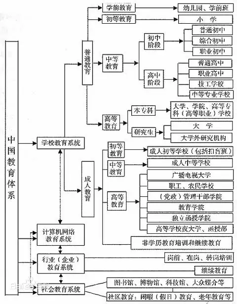

## 中国教育体系的划分

> 同一个国家不同时间段，教育是不同的，同一个国家不同地区也不同，不同国家更是不一样。从不同角度能划分多种样式出来，我们先看按照教育方式来划分一些最主要的部分。

### 家庭教育

* 家庭教育是指父母或者其他监护人为促进未成年人全面健康成长，对其实施的道德品质、身体素质、生活技能、文化修养、行为习惯等方面的培育、引导和影响。家庭教育以立德树人为根本任务，培育和践行社会主义核心价值观，弘扬中华民族优秀传统文化、革命文化、社会主义先进文化，促进未成年人健康成长。家庭教育其实是人生最主要的教育，人的学校教育最多不超过20年，可人一生都在家庭中，所以这个教育阶段很长而且很重要。	

### 学校教育

* 学校教育是在学校中实施的教育。特点：有固定的场所、专门的教师和一定数量的学生，有一定的培养目标、管理制度和规定的教学内容。我们按照学校教育的等级来划分

* 一、幼儿教育/学前教育/

幼儿教育，是指对3—6岁年龄阶段的幼儿所实施的教育。

幼儿教育也有广义和狭义之分，

> 从广义上说，凡是能够影响幼儿身体成长和认知、情感、性格等方面发展的有目的的活动，如幼儿在成人的指导下看电视、做家务、参加社会活动，等等，都可说是幼儿教育。

> 而狭义的幼儿教育则特指幼儿园和其他专门开设的幼儿教育机构的教育。

幼儿园教育在中国属于学校教育系统。但是幼儿园办学的机构有些是校外私人开办的托儿所或幼儿园，属于非义务制教育培训机构，而有些是在公立学校办的幼儿园。和学校教育一样，幼儿园教育也具有家庭教育和社会教育所没有的优点，如计划性、系统性等。幼儿园教育以幼儿园教师为主要对象，致力于宣传党和国家的幼儿教育政策，反映幼儿教育研究与改革成果，交流幼儿园、托儿所、家庭教育经验，介绍国内外幼儿教育信息，提供幼儿教育活动材料和教学参考资料。

孩子一般3岁开始上幼儿园，分为：小班（3-4周岁）、中班（4-5周岁）、大班（5-6周岁）。我们小时候就没有幼儿园，直接在学校上一年学前班，这个属于学前教育，区别就是学前教育是指出生在6、7周岁即将上小学的儿童的教育，幼儿教育是指3-6周岁处于幼儿园阶段的儿童的教育。

* 二、初等教育（小学）

在中国的大部分地区，小学教育被分为六年，小学属于九年义务教育范围，义务教育是国家法律规定的适龄儿童必须要上的，只要你不犯错误就一定能上的。而高中等是需要你考试通过才能上的，属于非义务教育部分。我们小时候最先没有六年级，只有五年级后面直接就是初中了，从我这届开始有了六年级。

*  三、中等教育（初中、高中、中职）

中等教育阶段包括初中阶段教育和高中阶段教育，初中属于九年义务教育范围。高中阶段包括普通高中和中等职业学校，中职学校主要包括中专（中等专业学校）、职高（职业高中）和技校（技工学校、高级技工学校、技师学院）。

* 四、高等教育（高职、大专、本科）

我国高等教育学校主要包括高等职业学校简称高职，大学专科学校简称大专，本科学校。高等教育学历包括四个层级：专科学历、本科学历、硕士研究生学历、博士研究生学历。高职属于专科学历。高等教育还有个学位，只有本科以上才有学位。

### 社会教育

* 社会教育（society education），广义指与学校教育、家庭教育并行的影响个人身心发展的社会教育活动；狭义指社会文化教育机构对青少年和人民群众开展的各种文化和生活知识的教育活动。

## 其它的教育分类

> 我们也可以按照其它的角度来划分，概念会与上面的重复，但是也有不同之处，比如

### 终身教育

终身教育（lifelong education） 是指人们在一生各阶段当中所受各种教育的总和，是人所受不同类型教育的统一综合。包括教育体系的各个阶段和各种方式，既有学校教育，又有社会教育；既有正规教育，也有非正规教育。主张在每一个人需要的时刻以最好的方式提供必要的知识和技能。终身教育思想成为很多国家教育改革的指导方针。

### 成人教育

### 特殊教育